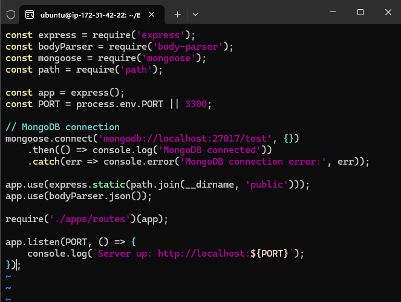
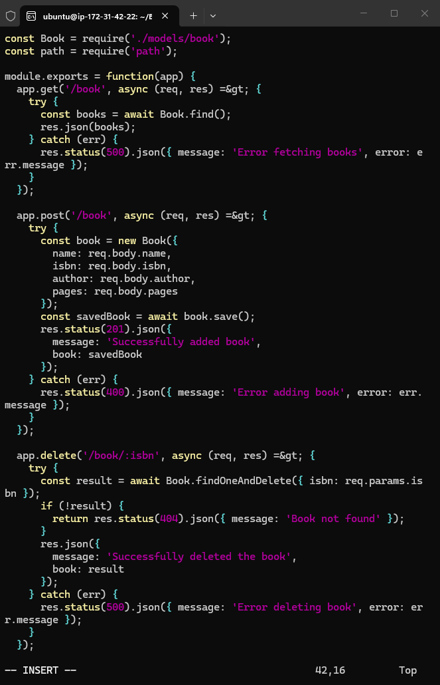
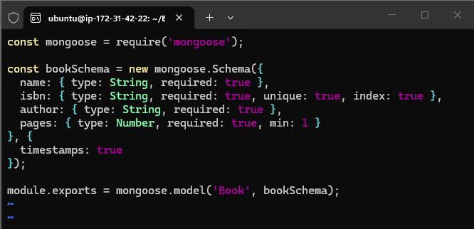
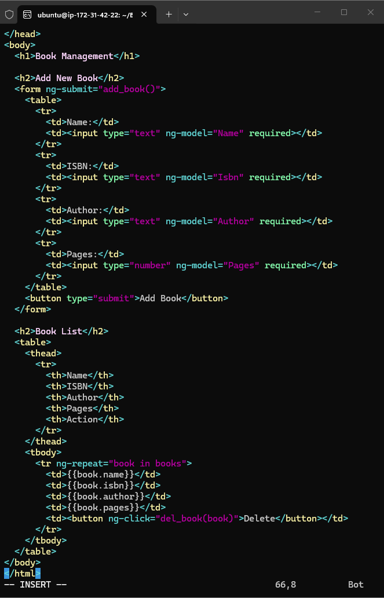

# MEAN-STACK-PROJECT

## Introduction

This is a documentation that explain the implementation, setup, configuration of MEAN stack project (book Management Web App) in AWS cloud. MEAN stack is one of the types of web stack that comprises of  MongoDB as the database for application data storage, ExpressJS as the Backend Application Framework, Angular as the frontend framework for user interface components and NodeJS as Javascript runtime Environment to run Javascript on a machine.

## PROJECT ARCHITECTURE


> AWS EC2 (Ubuntu 26.04) 
>    
> Backend Configuration
>
> Installing ExpressJS
> 
> Installing MongoDB
>
> MongoDB Database
>
> Testing backend Code without Frontend using RESTful API
>
> Frontend Creation
>
> Create React Componenets


# STEP 1 - PREREQUISITES
1. Login into AWS to create an Ec2 instance (LEMP SERVER) of t3.micro and Ubuntu Server 26.04 LTS (HVM), which was launched in eu-north 1b.

Ec2 Dashboard


```
ssh -i <sshkey.pem> Ubuntu@ipaddress
```


2. Server update and upgrade
```
sudo apt update
sudo apt upgrade
```


3.  Add certificates


4.  Install NodeJS

```
sudo apt install -y nodejs
```


# STEP 2 - MongoDB Installation
1.  Download the MongoDB public GPG key


2.  Add MongoDB Repository


3.  Install MongoDB


4.  Start the server and verify that the database server is up ans running


The command was not recognized because the command does not work for the updated version of MongoDB 5. the command was later changed to

```
sudo service mongod start
sudo systemctl status mongod
```


5.  Install Node Package Manager (NPM)

```
sudo apt install -y npm
```


6.  Install Body-parser

```
sudo npm install body-parser
```


7.  Create 'Books' directory and initialize the npm

```
mkdir Books && cd Books
npm init
```


8.  Create server.js file

```
vi server.js
```




# STEP 3 - ExpressJS Installation

1.  Install Express and Mongoose package

```
sudo npm install express mongoose
```


2.  Create 'apps' folder inside the previously created Books folder, then create routes.js file

```
mkdir apps && cd apps
vi routes.js
```




3.  Create 'models' folder inside the previosly created apps folder, and then create book.js file

```
mkdir models && cd models
vi book.js
```





# STEP 4 - AngularJS
1.  create a 'public' folder and then create a script.js file

```
mkdir public && cd public
vi script.js
```


2.  Create index.html file




3.  start the server

```
node server.js
```


There was a syntax error when trying to start the server. There was an error within the code script for the routes.js file.

The code was corrected and the server was connected successfully


4.   Open port 3300 in AWS web console


5.  Accessing the server usinf the web browser


6.  Adding addition info to verify the server is functioning


# Conclusion

